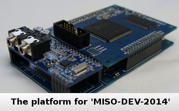
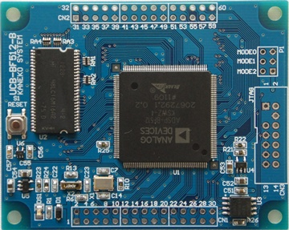
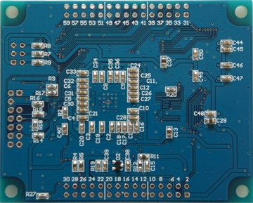
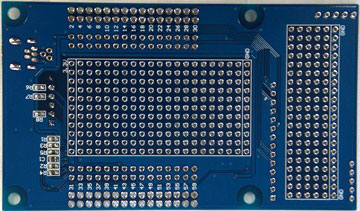
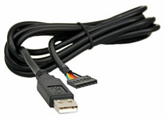

# What's the 'MISO-DEV-2014'

A last day of a year, Japanese people called it 'O-O-MI-SO-KA'.
One of the aliases is 'MISOKA' and I created the project name 'MISO-DEV' from 'the short alias'(MISO) and 'Development'(DEV).
This 'MISO-DEV-2014' is a project on the last day of 2014 using mruby, not a Japanese MISO project. :)
Please see also <https://atnd.org/events/59470>.

# Description

This mruby project is my first mruby project.
The target board is a small ADI Blackfin board and was developed by Kaneko-System in Japan.

I am trying to use mruby on the ADI Blackfin board and am learning mruby in this project.

# The Goal

The goal of this project is very simple.
Running mruby on the target platform is the goal.

# Requirement

## UCB-BF512-B (Kaneko-System)

## UCB-BF512-EXT-A (Kaneko-System)

## TTL-232R-3V3 (FTDI)

# Install

* Download mruby version 1.1.0 from <http://forum.mruby.org/download/source/mruby-1.1.0.tar.gz>.
* Download the reference for the target board from <http://kaneko-sys.co.jp/datasheet/ucb-bf512/UCB-BF512_users_manual_V4.pdf>.
* Download the schematic for the target board from <http://kaneko-sys.co.jp/datasheet/ucb-bf512/UCB-BF512-B_schematic_V1.pdf>.
* Downlaod the Schematic for the extension board from <http://kaneko-sys.co.jp/datasheet/ucb-bf512-ext/UCB-BF512-EXT-A.pdf>.

# References

## For mruby

* <http://forum.mruby.org/>
  * <http://forum.mruby.org/download/index3.html>
  * <https://github.com/mruby-Forum/mruby>

## For the ADI Blackfin board

* <http://kaneko-sys.co.jp/>
  * UCB-BF512-B : <http://dsps.shop-pro.jp/?pid=82796363>
    * User's Manual : <http://kaneko-sys.co.jp/datasheet/ucb-bf512/UCB-BF512_users_manual_V4.pdf>.
    * Board Schematic : <http://kaneko-sys.co.jp/datasheet/ucb-bf512/UCB-BF512-B_schematic_V1.pdf>.
  * UCB-BF512-EXT-A : <http://dsps.shop-pro.jp/?pid=82796604>
    * Board Schematic : <http://kaneko-sys.co.jp/datasheet/ucb-bf512-ext/UCB-BF512-EXT-A.pdf>
  * Support Page : <http://kaneko-sys.co.jp/support/>
    * **Please do NOT ask them about this project!**
    * **Please see also the license for this project!**

## For the flash writer

* <http://cubeatsystems.com/software/bfin-blueboot/bfin-blueboot_ja.html>
* <http://cubeatsystems.com/software/bfin-blueboot/bfin-blueboot_en.html>

## For the serial cable

* <http://www.ftdichip.com/Products/Cables/USBTTLSerial.htm>

# The development steps

1. Get the target board for the mruby platform.
  * You don't need it if you don't need running mruby on a embedded system.
2. Get the USB to serial interface converter for the programming.
  * Using a JTAG cable is better than the serial interface converter for the programming and the debugging.
3. Install rake, bison for the compiling mruby, bfin-elf-gcc for the compiling Blackfin programs.
  * Using Linux environment is easiest way to setup the development tools.
4. Compile 'uart\_test' for checking your environment.
  * Watch the output of UART, You will see some characters from the test program.

# License

* The license is MIT.

# Author

Shinichiro Nakamura (CuBeatSystems) @shintamainjp

